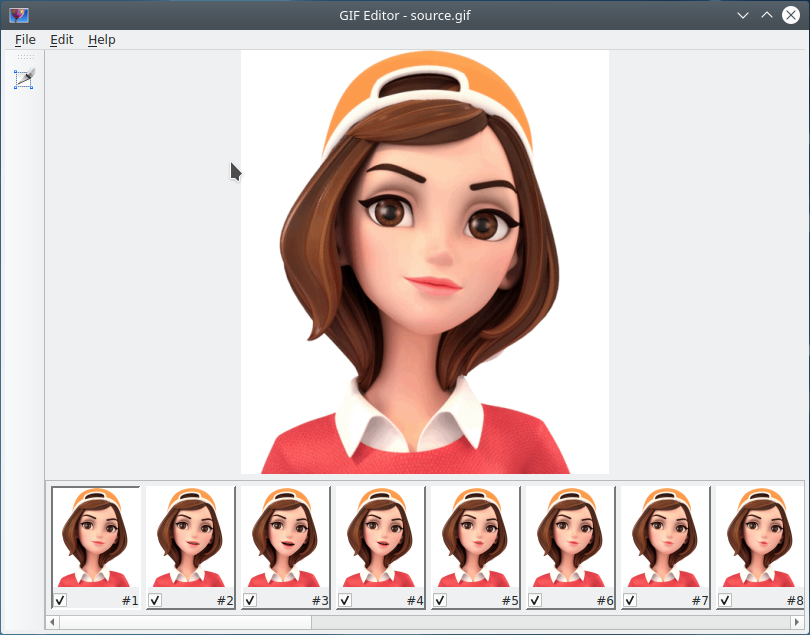

# About

Simple GIF Open Source editor. This GIF editor uses ImageMagick and creates
full image for each frame, so if you will try to open big GIF and will see
that only first some frames draws correctly, and the last ones - no, this can
mean that ImageMagick used all resources available to it. You can allow to use
more resources by editing policy.xml, for example enlarge disk quota.

```
<policy domain="resource" name="disk" value="10GiB"/>
```

# Dependencies

Magick++ from ImageMagick 6 is required.

# Book

There is a book about this project on GitHub
[https://github.com/igormironchik/qt-widgets-on-real-example](https://github.com/igormironchik/qt-widgets-on-real-example)

# Screenshot



# Donate

[Donate with BTC](https://github.com/igormironchik)
